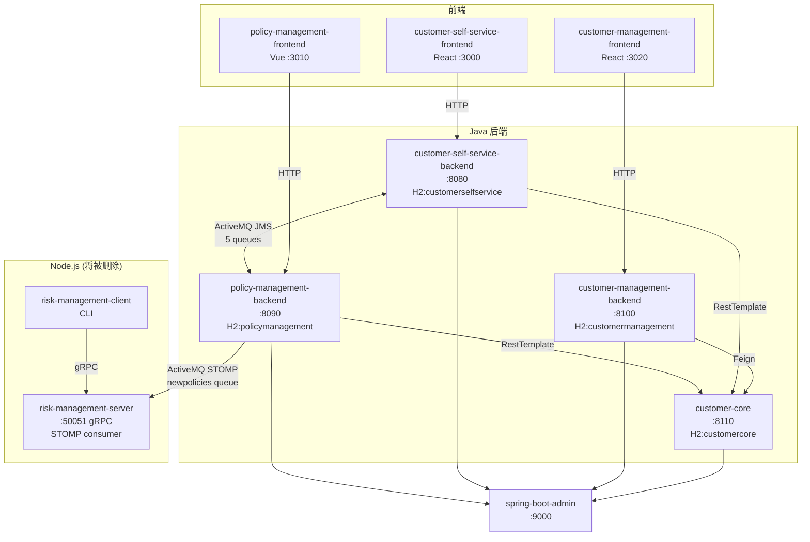
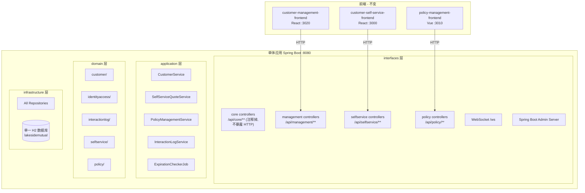

# LakesideMutual 微服务转单体架构转化计划

## 一、现有架构概览



## 二、目标架构



## 三、关键决策汇总

| 决策项 | 选择 |
|--------|------|
| 数据库 | 单一 H2 数据库，冲突表名加前缀 |
| risk-management | 整体删除（交互极少、纯单向 fire-and-forget、不影响核心业务） |
| 前端 | 保持 3 个独立前端，修改 API 地址 |
| Spring Boot Admin | 嵌入单体（加 server 依赖） |
| 包结构 | 顶层按层，层内按业务域 |
| 公共代码 | 仅提取 CustomerId 为公共类，其余保持各模块独立 |
| API 路径 | 统一加服务前缀（/api/core/, /api/management/, /api/selfservice/, /api/policy/），不再对外暴露的端点注释掉 |
| JMS/ActiveMQ | 按 A/B/C 三类分别改造 |

## 四、详细转化步骤

### Phase 0: 新建单体项目骨架

在 `LakesideMutual-master/` 同级创建 `lakeside-mutual-monolith/` 目录，建立单一 Maven 项目。

- **pom.xml**: 合并 4 个 Java 服务的依赖，去除微服务特有依赖：
  - 移除: `spring-cloud-starter-openfeign`, `spring-cloud-starter-bootstrap`, `spring-cloud-starter-circuitbreaker-resilience4j`, `spring-boot-starter-activemq`, `activemq-broker`, `activemq-stomp`, `activemq-kahadb-store`, `jackson-dataformat-csv` (若仅被 risk-management 使用)
  - 保留: `spring-boot-starter-data-jpa`, `spring-boot-starter-web`, `spring-boot-starter-security`, `spring-boot-starter-actuator`, `spring-boot-starter-websocket`, `spring-hateoas`, `h2`, `jjwt-*`, `springdoc-openapi`, `libphonenumber`, `quartz`, `domaindrivendesign-library` 等
  - 新增: `spring-boot-admin-starter-server` (嵌入式 Admin)
- **application.properties**: 单一配置文件，合并所有配置
- **主类**: `LakesideMutualApplication.java` 带 `@SpringBootApplication` 和 `@EnableAdminServer`

### Phase 1: 包结构与 domain 层迁移

目标包结构:

```
com.lakesidemutual/
├── LakesideMutualApplication.java
├── domain/
│   ├── customer/          ← from customer-core
│   │   ├── CustomerAggregateRoot
│   │   ├── CustomerId        ← 【公共类】所有模块共用
│   │   ├── CustomerProfileEntity
│   │   ├── Address
│   │   ├── CustomerFactory
│   │   └── CityLookupService
│   ├── identityaccess/    ← from customer-self-service
│   │   ├── UserLoginEntity
│   │   └── UserDetailsServiceImpl
│   ├── interactionlog/    ← from customer-management
│   │   ├── InteractionLogAggregateRoot
│   │   ├── InteractionEntity
│   │   ├── Notification
│   │   └── InteractionLogService
│   ├── selfservice/       ← from customer-self-service
│   │   ├── InsuranceQuoteRequestAggregateRoot  (自服务视角)
│   │   ├── InsuranceQuoteEntity
│   │   ├── InsuranceOptionsEntity
│   │   ├── CustomerInfoEntity
│   │   ├── RequestStatusChange
│   │   ├── MoneyAmount
│   │   └── RequestStatus
│   ├── policy/            ← from policy-management
│   │   ├── PolicyAggregateRoot
│   │   ├── PolicyId, PolicyPeriod, PolicyType
│   │   ├── InsuringAgreementEntity, InsuringAgreementItem
│   │   ├── MoneyAmount
│   │   ├── InsuranceQuoteRequestAggregateRoot  (策略管理视角)
│   │   ├── InsuranceQuoteEntity
│   │   ├── InsuranceOptionsEntity
│   │   ├── CustomerInfoEntity
│   │   ├── InsuranceType
│   │   ├── RequestStatusChange
│   │   └── Address
├── application/
├── infrastructure/
└── interfaces/
```

关键操作:
- **仅提取 CustomerId 为公共类**: 4 个服务各有一份结构相同的 CustomerId，统一为 `domain.customer.CustomerId`，修改所有引用。这是唯一需要提取的公共数据结构，最严谨
- **其余重复类保持各模块独立**: Address、MoneyAmount、AddressDto 等虽然看似重复，但各模块可能存在微妙差异，保留在各自的 domain 子包中，通过包名自然隔离
- **InsuranceQuoteRequest 保留两份**: self-service 和 policy-management 的 `InsuranceQuoteRequestAggregateRoot` 字段和状态机不同，分别放在 `domain.selfservice` 和 `domain.policy` 中，用 `@Table` 注解区分表名（如 `ss_insurance_quote_request` 和 `pm_insurance_quote_request`）
- **Event 类改造**: 原 JMS Event DTO 类按类别处理：
  - Category A 的事件类（InsuranceQuoteRequestEvent, CustomerDecisionEvent）不再需要，改为同步调用的参数/返回值
  - Category B 的事件类（InsuranceQuoteResponseEvent, InsuranceQuoteExpiredEvent, PolicyCreatedEvent）改造为 Spring ApplicationEvent 子类

### Phase 2: infrastructure 层迁移

```
infrastructure/
├── CustomerRepository        ← from customer-core
├── UserLoginRepository        ← from self-service
├── InteractionLogRepository   ← from management
├── SelfServiceInsuranceQuoteRequestRepository  ← from self-service
├── PolicyInsuranceQuoteRequestRepository       ← from policy-management
├── PolicyRepository           ← from policy-management
├── CustomerDataLoader         ← from customer-core（加载 mock 客户数据）
└── UserLoginDataLoader        ← from customer-self-service（加载 mock 用户登录数据）
```

- 将各服务的 `@Repository` 接口直接迁移，修改 import 到新的 domain 包路径
- **保留两个独立 DataLoader**（不合并）：customer-core 的 DataLoader 加载 mock 客户数据到 CustomerRepository，customer-self-service 的 DataLoader 创建对应的 UserLogin 数据到 UserLoginRepository。它们做的是不同的事情，保持独立。通过 `@Order` 注解确保 CustomerDataLoader 先于 UserLoginDataLoader 执行（后者依赖前者的客户数据）

### Phase 3: application 层迁移与服务间调用改造

```
application/
├── CustomerService            ← from customer-core（核心客户操作）
├── InteractionLogApplicationService  ← 封装 interactionlog 操作
├── SelfServiceQuoteService    ← 新建：承接原 JMS producer 的编排逻辑 + 原 self-service JMS consumer 的业务逻辑
├── PolicyQuoteService         ← 新建：承接原 policy-management JMS consumer 的业务逻辑（InsuranceQuoteRequestMessageConsumer + CustomerDecisionMessageConsumer）
├── PolicyService              ← from policy-management
├── ExpirationCheckerJob       ← from policy-management（保留 Quartz）
└── Page                       ← from customer-core
```

**核心改造 - 服务间调用转化:**

#### 3.1 同步 HTTP 调用 → 直接 Java 方法调用

| 原调用 | 原方式 | 改造后 |
|--------|--------|--------|
| management → customer-core 获取/更新客户 | Feign (CustomerCoreClient) | 直接注入 CustomerService 调用 |
| self-service → customer-core 获取/创建/更新客户 | RestTemplate (CustomerCoreRemoteProxy) | 直接注入 CustomerService 调用 |
| policy → customer-core 获取客户 | RestTemplate (CustomerCoreRemoteProxy) | 直接注入 CustomerService 调用 |

**删除的类**: `CustomerCoreClient`, `CustomerCoreClientConfiguration`, `APIKeyRequestInterceptor`, 3个 `CustomerCoreRemoteProxy`, `DefaultAuthenticatedRestTemplateClient`, `HeaderRequestInterceptor`, `CustomerCoreServiceMBean`

#### 3.2 JMS/ActiveMQ → 按 A/B/C 分类改造

**类别 A：主业务流程 → 同步方法调用**

(1) **创建保险报价请求** (self-service → policy)
- 原流程: `InsuranceQuoteRequestCoordinator.createInsuranceQuoteRequest()` → `PolicyManagementMessageProducer.sendInsuranceQuoteRequest()` → JMS → `InsuranceQuoteRequestMessageConsumer.receiveInsuranceQuoteRequest()`
- 新流程: `SelfServiceQuoteController.createInsuranceQuoteRequest()` → `SelfServiceQuoteService.createQuoteRequest()`:
  1. 在 self-service 侧保存 InsuranceQuoteRequest
  2. 直接调用 `PolicyQuoteService.receiveInsuranceQuoteRequest()` 在 policy 侧创建对应记录
  3. 返回结果

(2) **客户接受/拒绝报价** (self-service → policy)
- 原流程: `InsuranceQuoteRequestCoordinator.respondToInsuranceQuote()` → `PolicyManagementMessageProducer.sendCustomerDecision()` → JMS → `CustomerDecisionMessageConsumer.receiveCustomerDecision()`
- 新流程: `SelfServiceQuoteController.respondToInsuranceQuote()` → `SelfServiceQuoteService.handleCustomerDecision()`:
  1. 在 self-service 侧更新状态
  2. 直接调用 `PolicyQuoteService.handleCustomerDecision(quoteRequestId, accepted)`:
     - 若接受且未过期：创建 Policy，返回 policyId
     - 若接受但已过期：返回过期状态
     - 若拒绝：更新状态
  3. Self-service 侧根据返回结果更新自己的状态（如设置 policyId、标记过期等）

**类别 B：后置反应 → Spring ApplicationEvent**

(3) **保险报价响应** (policy → self-service)
- 原流程: `InsuranceQuoteRequestProcessingResource.respondToInsuranceQuoteRequest()` → `CustomerSelfServiceMessageProducer.sendInsuranceQuoteResponseEvent()` → JMS → `InsuranceQuoteResponseMessageConsumer`
- 新流程: `PolicyQuoteService.respondToQuoteRequest()`:
  1. 更新 policy 侧的 InsuranceQuoteRequest
  2. 发布 `InsuranceQuoteResponseApplicationEvent`
  3. `SelfServiceQuoteEventListener.onQuoteResponse()` 更新 self-service 侧记录

(4) **报价过期** (policy → self-service)
- 原流程: `ExpirationCheckerJob` → `CustomerSelfServiceMessageProducer.sendInsuranceQuoteExpiredEvent()` → JMS → `InsuranceQuoteExpiredMessageConsumer`
- 新流程: `ExpirationCheckerJob`:
  1. 检查并更新过期的报价
  2. 发布 `InsuranceQuoteExpiredApplicationEvent`
  3. `SelfServiceQuoteEventListener.onQuoteExpired()` 更新 self-service 侧记录

(5) **保单已创建** (policy → self-service)
- 原流程: `CustomerSelfServiceMessageProducer.sendPolicyCreatedEvent()` → JMS → `PolicyCreatedMessageConsumer`
- 新流程: `PolicyQuoteService.handleCustomerDecision()` 中创建 Policy 后：
  1. 发布 `PolicyCreatedApplicationEvent`
  2. `SelfServiceQuoteEventListener.onPolicyCreated()` 更新 self-service 侧的 InsuranceQuoteRequest（设置 policyId、状态变为 POLICY_CREATED）
- 注意：虽然 A(2) 的同步流程中 self-service 可以从返回值获得 policyId，但保留 PolicyCreatedApplicationEvent 更清晰：保持 self-service 侧状态更新逻辑统一在 EventListener 中

~~(6) **policy → risk-management: 新保单通知** → 已删除（risk-management 整体移除）~~

**类别 C：后台调度 → 保留 Scheduler**

ExpirationCheckerJob 是一个 Quartz 定时任务，它是 B(4)（报价过期）的触发源。单体中保留为 Quartz 定时器，只是将原来通过 JMS 发送 InsuranceQuoteExpiredEvent 改为发布 ApplicationEvent（即 B(4) 所述流程）。不是独立的第 7 个 JMS 流程。

**删除的类**: `PolicyManagementMessageProducer`, `CustomerSelfServiceMessageProducer`, `RiskManagementMessageProducer`, `InsuranceQuoteRequestMessageConsumer`, `CustomerDecisionMessageConsumer`, `InsuranceQuoteResponseMessageConsumer`, `InsuranceQuoteExpiredMessageConsumer`, `PolicyCreatedMessageConsumer`, 两个 `MessagingConfiguration`, `UpdatePolicyEvent`, `DeletePolicyEvent`

#### 3.3 risk-management 相关调用 → 直接删除

原来 `PolicyInformationHolder` 和 `CustomerDecisionMessageConsumer` 中通过 `RiskManagementMessageProducer.emitEvent()` 向 risk-management-server 发送事件的 4 处调用全部删除（详见 Phase 5）。

### Phase 4: interfaces 层迁移

#### 4.1 API 路径策略：统一加服务前缀

**策略**: 所有 Controller 统一加服务前缀，不做"智能去重"，方便后续调整。customer-core 的 Controller 在单体中不再对外暴露 HTTP 端点，注释掉 `@RestController` 和 `@RequestMapping` 注解。

**完整 API 路径映射表**:

**customer-core → `/api/core/` （注释掉，不暴露 HTTP）**

| 原路径 | Controller | 新路径（注释掉） | 说明 |
|--------|-----------|----------------|------|
| `GET /customers` | CustomerInformationHolder | ~~`/api/core/customers`~~ | 改为内部 Java 调用 CustomerService |
| `GET /customers/{ids}` | CustomerInformationHolder | ~~`/api/core/customers/{ids}`~~ | 同上 |
| `PUT /customers/{id}` | CustomerInformationHolder | ~~`/api/core/customers/{id}`~~ | 同上 |
| `PUT /customers/{id}/address` | CustomerInformationHolder | ~~`/api/core/customers/{id}/address`~~ | 同上 |
| `POST /customers` | CustomerInformationHolder | ~~`/api/core/customers`~~ | 同上 |
| `GET /cities/{postalCode}` | CityReferenceDataHolder | ~~`/api/core/cities/{postalCode}`~~ | 同上 |
| `GET /getCustomers/{ids}` | OldCustomerInformationHolder | ~~`/api/core/getCustomers/{ids}`~~ | 301 重定向端点，不需要 |

做法：迁移时保留 Controller 代码，但**注释掉类级别的 `@RestController` 和 `@RequestMapping` 注解**。代码保留在文件中，将来若需要暴露可随时取消注释。底层的 `CustomerService` 仍被其他模块直接注入调用。

**customer-management-backend → `/api/management/` （全部暴露）**

| 原路径 | Controller | 新路径 | 前端调用方 |
|--------|-----------|--------|-----------|
| `GET /customers` | CustomerInformationHolder | `/api/management/customers` | management-frontend |
| `GET /customers/{id}` | CustomerInformationHolder | `/api/management/customers/{id}` | management-frontend |
| `PUT /customers/{id}` | CustomerInformationHolder | `/api/management/customers/{id}` | management-frontend |
| `GET /customers/{id}/policies` | CustomerInformationHolder | `/api/management/customers/{id}/policies` | management-frontend |
| `GET /notifications` | NotificationInformationHolder | `/api/management/notifications` | management-frontend |
| `GET /interaction-logs/{id}` | InteractionLogInformationHolder | `/api/management/interaction-logs/{id}` | management-frontend |
| `PATCH /interaction-logs/{id}` | InteractionLogInformationHolder | `/api/management/interaction-logs/{id}` | management-frontend |

**customer-self-service-backend → `/api/selfservice/` （全部暴露）**

| 原路径 | Controller | 新路径 | 前端调用方 |
|--------|-----------|--------|-----------|
| `POST /auth` | AuthenticationController | `/api/selfservice/auth` | self-service-frontend |
| `POST /auth/signup` | AuthenticationController | `/api/selfservice/auth/signup` | self-service-frontend |
| `GET /user` | UserInformationHolder | `/api/selfservice/user` | self-service-frontend |
| `GET /customers/{id}` | CustomerInformationHolder | `/api/selfservice/customers/{id}` | self-service-frontend |
| `PUT /customers/{id}/address` | CustomerInformationHolder | `/api/selfservice/customers/{id}/address` | self-service-frontend |
| `POST /customers` | CustomerInformationHolder | `/api/selfservice/customers` | self-service-frontend |
| `GET /customers/{id}/insurance-quote-requests` | CustomerInformationHolder | `/api/selfservice/customers/{id}/insurance-quote-requests` | self-service-frontend |
| `GET /cities/{postalCode}` | CityReferenceDataHolder | `/api/selfservice/cities/{postalCode}` | self-service-frontend |
| `GET /insurance-quote-requests` | InsuranceQuoteRequestCoordinator | `/api/selfservice/insurance-quote-requests` | self-service-frontend |
| `GET /insurance-quote-requests/{id}` | InsuranceQuoteRequestCoordinator | `/api/selfservice/insurance-quote-requests/{id}` | self-service-frontend |
| `POST /insurance-quote-requests` | InsuranceQuoteRequestCoordinator | `/api/selfservice/insurance-quote-requests` | self-service-frontend |
| `PATCH /insurance-quote-requests/{id}` | InsuranceQuoteRequestCoordinator | `/api/selfservice/insurance-quote-requests/{id}` | self-service-frontend |

**policy-management-backend → `/api/policy/` （全部暴露）**

| 原路径 | Controller | 新路径 | 前端调用方 |
|--------|-----------|--------|-----------|
| `GET /customers` | CustomerInformationHolder | `/api/policy/customers` | policy-frontend |
| `GET /customers/{id}` | CustomerInformationHolder | `/api/policy/customers/{id}` | policy-frontend |
| `GET /customers/{id}/policies` | CustomerInformationHolder | `/api/policy/customers/{id}/policies` | policy-frontend |
| `GET /policies` | PolicyInformationHolder | `/api/policy/policies` | policy-frontend |
| `GET /policies/{id}` | PolicyInformationHolder | `/api/policy/policies/{id}` | policy-frontend |
| `POST /policies` | PolicyInformationHolder | `/api/policy/policies` | policy-frontend |
| `PUT /policies/{id}` | PolicyInformationHolder | `/api/policy/policies/{id}` | policy-frontend |
| `DELETE /policies/{id}` | PolicyInformationHolder | `/api/policy/policies/{id}` | policy-frontend |
| `GET /insurance-quote-requests` | InsuranceQuoteRequestProcessingResource | `/api/policy/insurance-quote-requests` | policy-frontend |
| `GET /insurance-quote-requests/{id}` | InsuranceQuoteRequestProcessingResource | `/api/policy/insurance-quote-requests/{id}` | policy-frontend |
| `PATCH /insurance-quote-requests/{id}` | InsuranceQuoteRequestProcessingResource | `/api/policy/insurance-quote-requests/{id}` | policy-frontend |
| `POST /riskfactor/compute` | RiskComputationService | `/api/policy/riskfactor/compute` | policy-frontend |

```
interfaces/
├── configuration/
│   ├── WebSecurityConfiguration    ← 合并 4 个安全配置
│   ├── WebConfiguration           ← 合并 CORS 等
│   ├── WebSocketConfiguration     ← from management (chat)
│   ├── SwaggerConfiguration       ← 合并
│   └── QuartzConfiguration        ← from policy-management
├── core/                          ← @RequestMapping("/api/core") 【注释掉 @RestController】
│   ├── CoreCustomerController     (注释掉注解，保留代码)
│   ├── CoreCityController         (注释掉注解，保留代码)
│   └── CoreOldCustomerController  (注释掉注解，保留代码)
├── management/                    ← @RequestMapping("/api/management")
│   ├── ManagementCustomerController
│   ├── InteractionLogController
│   └── NotificationController
├── selfservice/                   ← @RequestMapping("/api/selfservice")
│   ├── AuthenticationController
│   ├── SelfServiceCustomerController
│   ├── SelfServiceQuoteController
│   ├── UserController
│   └── CityController
├── policy/                        ← @RequestMapping("/api/policy")
│   ├── PolicyCustomerController
│   ├── PolicyController
│   ├── PolicyQuoteController
│   └── RiskComputationController
└── dtos/
    ├── customer/     ← 公共 DTO (CustomerDto, AddressDto 等)
    ├── selfservice/  ← 自服务专用 DTO
    ├── policy/       ← 策略管理专用 DTO
    └── management/   ← 客户管理专用 DTO
```

#### 4.2 安全配置合并

当前各服务安全策略:
- **customer-core**: API Key 认证 → 单体中不再需要（内部调用）
- **customer-self-service**: JWT Token + BCrypt 认证 → 保留，仅对 `/api/selfservice/**` 路径生效
- **customer-management**: 无认证（开放） → 保留开放
- **policy-management**: 无认证（开放） → 保留开放

合并后的 SecurityFilterChain 配置:
```java
// /api/selfservice/auth/** -> permitAll (登录注册)
// /api/selfservice/** -> 需要 JWT 认证
// /api/management/** -> permitAll
// /api/policy/** -> permitAll
// /swagger-ui/**, /v3/api-docs/**, /actuator/** -> permitAll
// /ws/** -> permitAll (WebSocket)
```

#### 4.3 WebSocket 配置
- 保留 customer-management 的 WebSocket 配置 (STOMP over WebSocket for chat)
- Endpoint: `/ws`，broker: `/topic`

#### 4.4 Spring Boot Admin 嵌入
- pom.xml 添加 `spring-boot-admin-starter-server`
- 主类添加 `@EnableAdminServer`
- 可通过 `/applications` 访问 Admin UI

### Phase 5: 删除 risk-management 组件

risk-management-server（Node.js gRPC+STOMP 服务）和 risk-management-client（Node.js CLI）与核心业务完全无关，仅提供单向"保单事件 → CSV 报告"功能，交互方式为 fire-and-forget（不返回任何结果给调用方）。整体删除。

#### 5.1 删除整个目录
- `risk-management-server/` 目录（Node.js gRPC server + STOMP consumer）
- `risk-management-client/` 目录（Node.js gRPC CLI client）

#### 5.2 删除 Java 源文件（policy-management-backend 模块中）
| 文件 | 路径 | 说明 |
|------|------|------|
| `RiskManagementMessageProducer.java` | `infrastructure/` | ActiveMQ STOMP 事件生产者 |
| `UpdatePolicyEvent.java` | `domain/policy/` | 保单创建/更新事件 DTO |
| `DeletePolicyEvent.java` | `domain/policy/` | 保单删除事件 DTO |
| `RiskManagementMessageProducerTests.java` | `tests/infrastructure/` | 对应测试类 |

#### 5.3 清理存活文件中的引用（共 4 处 emitEvent 调用）

**文件 1: `PolicyInformationHolder.java`**（policy-management interfaces 层）
- 删除 `import RiskManagementMessageProducer`
- 删除 `import UpdatePolicyEvent`
- 删除 `import DeletePolicyEvent`
- 删除 `@Autowired private RiskManagementMessageProducer riskManagementMessageProducer` 字段
- 删除 `createPolicy()` 中的 `new UpdatePolicyEvent(...)` + `riskManagementMessageProducer.emitEvent(event)` (2 行)
- 删除 `updatePolicy()` 中的 `new UpdatePolicyEvent(...)` + `riskManagementMessageProducer.emitEvent(event)` (2 行)
- 删除 `deletePolicy()` 中的 `new DeletePolicyEvent(...)` + `riskManagementMessageProducer.emitEvent(event)` (2 行)

**文件 2: `CustomerDecisionMessageConsumer.java`**（后续在 Phase 3 中被重写为 `PolicyQuoteService`，其中原有的 `riskManagementMessageProducer.emitEvent()` 调用自然不会被迁移）
- 原文件中的 `import RiskManagementMessageProducer`, `import UpdatePolicyEvent`, `@Autowired` 字段, 以及 `receiveCustomerDecision()` 中 `emitEvent()` 调用（1 处）—— 在重写为 `PolicyQuoteService.handleCustomerDecision()` 时自然移除

#### 5.4 清理配置残留
- `application.properties` (policy-management): 删除 `riskmanagement.queueName=newpolicies`

#### 5.5 清理 docker/run 配置
- `docker-compose.yml`: 删除 `risk-management-server` service 定义
- `kubernetes/docker-compose.yml`: 删除 `risk-management-server` service 定义
- `.run/risk-management-server.run.xml`: 删除
- `.run/build_risk-management-server.run.xml`: 删除
- `.run/build_all_docker_images.run.xml`: 移除 risk-management-server 相关部分

#### 5.6 清理测试文件
- `PolicyInformationHolderTests.java`: 移除对 `RiskManagementMessageProducer` 的 mock 和验证

### Phase 6: 配置文件与数据库

**application.properties** 合并:
```properties
spring.application.name=lakeside-mutual
server.port=8080

# 单一 H2 数据库
spring.datasource.url=jdbc:h2:file:./lakesidemutual
spring.datasource.username=sa
spring.datasource.password=sa
spring.datasource.driver-class-name=org.h2.Driver
spring.jpa.hibernate.ddl-auto=create-drop

# Jackson
spring.jackson.serialization.INDENT_OUTPUT=true
spring.jackson.default-property-inclusion=NON_NULL

# JWT (self-service auth)
token.header=X-Auth-Token
token.expiration=604800

# Management
management.endpoints.web.exposure.include=*

# 允许 bean 覆盖
spring.main.allow-bean-definition-overriding=true
```

**数据库表名冲突解决**:
- self-service `InsuranceQuoteRequestAggregateRoot` → `@Table(name = "ss_insurance_quote_request")`
- policy `InsuranceQuoteRequestAggregateRoot` → `@Table(name = "pm_insurance_quote_request")`
- 类似地处理其他冲突的实体表名（InsuranceQuoteEntity, InsuranceOptionsEntity, CustomerInfoEntity, RequestStatusChange, Address 等）

### Phase 7: 前端适配

3 个前端修改 API 基础地址配置（所有端点统一到单体的 8080 端口 + 服务前缀）:

**customer-management-frontend** (React):
- `REACT_APP_CUSTOMER_MANAGEMENT_BACKEND`: `http://localhost:8100` → `http://localhost:8080/api/management`
- WebSocket endpoint: `ws://localhost:8100/ws` → `ws://localhost:8080/ws`

**customer-self-service-frontend** (React):
- `REACT_APP_CUSTOMER_SELF_SERVICE_BACKEND`: `http://localhost:8080` → `http://localhost:8080/api/selfservice`

**policy-management-frontend** (Vue):
- `VUE_APP_POLICY_MANAGEMENT_BACKEND`: `http://localhost:8090` → `http://localhost:8080/api/policy`

注意：前端代码中可能存在硬编码的 API 路径拼接（如 `${baseUrl}/customers/${id}`），这些路径在加了服务前缀后仍然正确，因为基础地址已经包含了前缀。需要逐一检查确认。

### Phase 8: 测试与清理

- 移除不再需要的微服务特有代码和配置
- 更新 `docker-compose.yml`（单体只需一个 service + 3 个前端，删除 risk-management-server）
- 更新启动脚本和文档（STARTUP_GUIDE.md 等）
- 逐模块验证 API 功能：
  - management-frontend → `/api/management/*` 全流程
  - self-service-frontend → `/api/selfservice/*` 全流程（含登录、创建报价、接受/拒绝报价）
  - policy-frontend → `/api/policy/*` 全流程（含报价审批、保单管理）
  - WebSocket chat 功能
  - 定时任务（ExpirationCheckerJob 报价过期）

## 五、风险与注意事项

1. **JPA 实体表名冲突**: self-service 和 policy-management 的 `InsuranceQuoteRequestAggregateRoot` 默认映射到同名表，必须通过 `@Table` 重命名
2. **安全上下文冲突**: self-service 使用 JWT 认证，其他模块开放访问，合并 SecurityFilterChain 时需按路径精确匹配
3. **DataLoader 顺序**: customer 数据必须先于 UserLogin 数据加载（有外键引用关系）
4. **前端 CORS**: 3 个前端运行在不同端口，单体需正确配置 CORS 允许所有前端域
5. **import 全量重构**: 按层重组包结构意味着几乎所有 Java 文件的 import 语句需要修改
6. **Event DTO 类型映射**: 原 JMS 的 Event 类需要改造为 Spring ApplicationEvent 子类或在事件监听器中直接使用新的参数对象
7. **HATEOAS 链接**: 原各模块的 Controller 中生成的 HATEOAS self-link 使用 `linkTo(methodOn(...))`，路径前缀变更后需确认链接正确性
8. **risk-management 功能丧失**: 删除后无法生成 CSV 风险报告，但不影响核心保险业务流程
